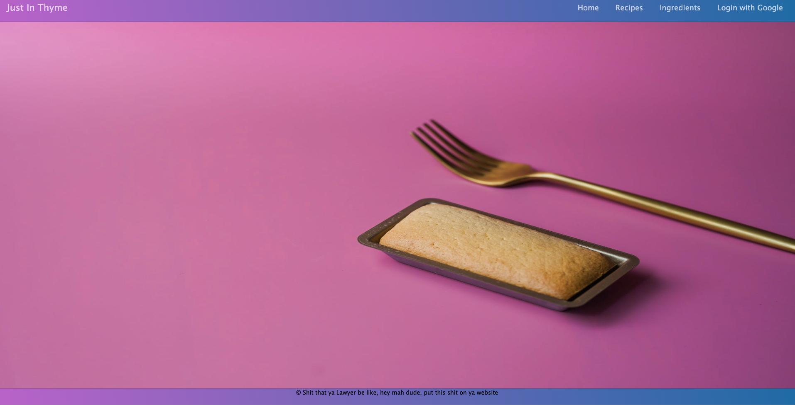
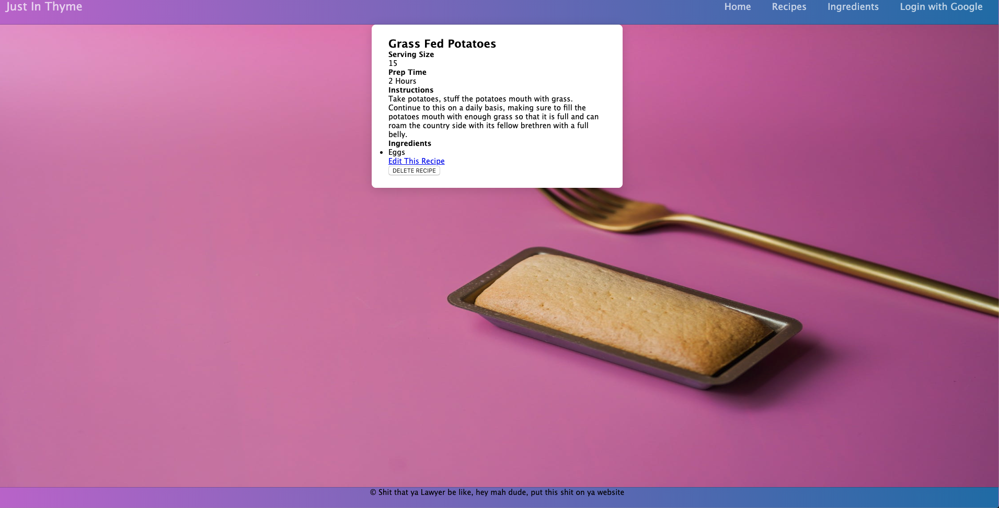
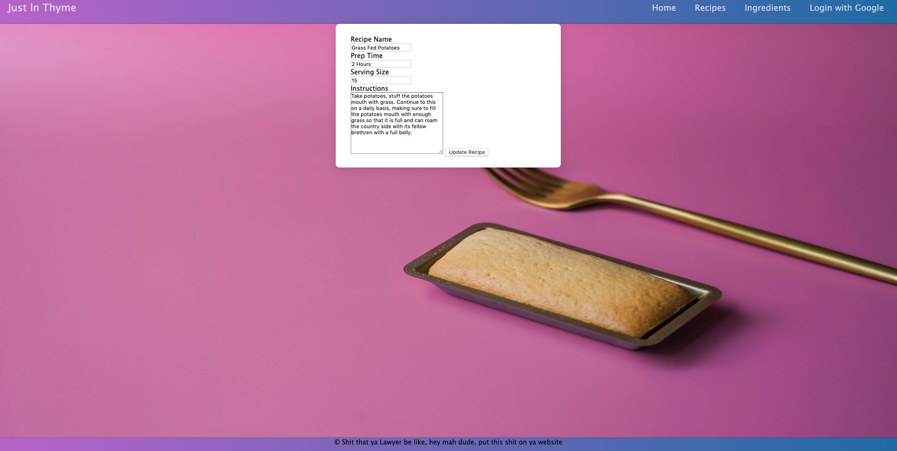

## Just in Thyme

This is an app designed to help the end user create a recipe. The user will be able to create and share the recipe with others on this website, by sharing the link with them.

*This app uses the following technologies:
+  HTML   
+  CSS     
+  Javascript
+  NodeJS
+  MongoDB
+  Mongoose

### Getting Started
Using this website is simple! If you want to view or create recipes simply click the recipe button at the top of the page. It will bring you to a prompt that will show the recipe names, and the options to create a new recipe. If you want to create a recipe, click the button, and fill out the form. If you need to add ingredients that are not currently listed, simply go the the infredients tab, and add them to that page, and you can edit the recipe once you have added them by navigating back to the recipe, and selecting the "Edit This Button" link. 

* Icebox Features
+ In the future some additional features would be to connect the ingredient list through an API connection to a database storing ingredient information. 
+ It would include a grocery list.
+ You would be able to link recipes togethor for catoring events, and be formatted to print labels with QR codes for the different labels, if someone wanted to look up the associated ingredients with each individual recipe. 

### Home Page

### Recipe Form Page

### Edit Recipe Page

